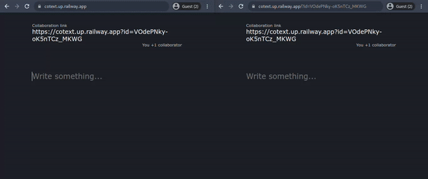

# Cotext

Cotext is a minimalistic realtime-time collaborative text editor.

The server is written in java using the [Spring Boot](https://spring.io/projects/spring-boot) framework, and the
frontend in javascript, html and
css. [Operational Transformation](https://en.wikipedia.org/wiki/Operational_transformation) has been implemented to keep
the text documents consistent across multiple concurrent edits.

## Get it running

**You will need Git and Java 11 installed**

1. Create a directory and cd into it.
2. Clone the git repository into the current directory: `git clone https://github.com/tamal8730/cotext.git .`.
3. Build the project using `./gradlew build`. A jar file named `cotext-app-0.0.1.jar` will be generated in `build/libs/`
   .
4. Move into the directory containing the generated jar: `cd build/libs`.
5. Execute the generated jar file: `java -jar cotext-app-0.0.1.jar`.
6. Open http://127.0.0.1:9390 in your browser.

## License

[MIT](https://choosealicense.com/licenses/mit/)

    